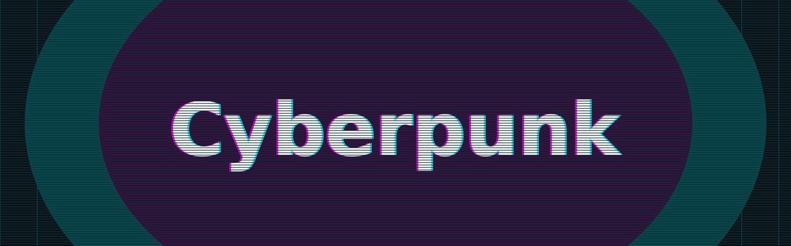
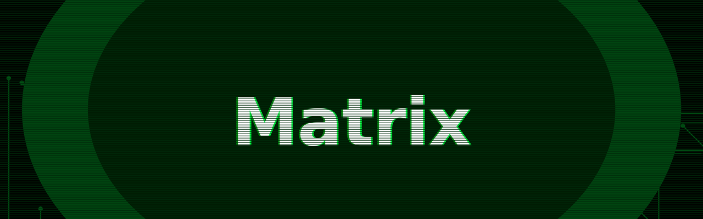
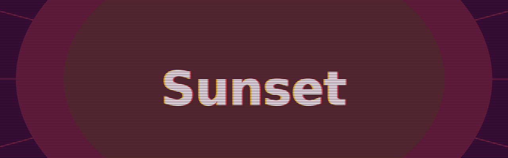
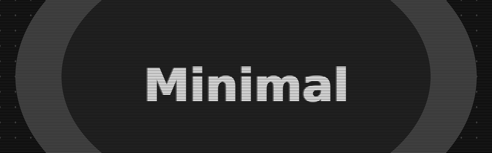

# 🎨 BrandPulse

A high-utility CLI tool to generate professional GitHub README banners with a consistent "Retro-Arcade Glitch" aesthetic.


## 🚀 Why BrandPulse?
GitHub READMEs are the front door to your projects. Manually creating banners in image editors takes too long, and generic templates lack personality. **BrandPulse** solves this by providing a terminal-first, high-fidelity branding engine.

## 🖼️ Examples

| Cyberpunk (Default) | Matrix |
| :---: | :---: |
|  |  |

| Sunset | Forest |
| :---: | :---: |
|  |  |

| Ocean | Minimal (Mono) |
| :---: | :---: |
|  |  |

## ✨ Features
- [x] **4X Super-sampling**: Renders at massive 3840x1200 resolution for razor-sharp edges.
- [x] **Theme Presets**: Switch between styles like `Cyberpunk`, `Matrix`, `Sunset`, `Forest`, and `Ocean`.
- [x] **Geometric Patterns**: Add textures like `Hex`, `Grid`, `Waves`, or `Circuit`.
- [x] **Dynamic Effects**: Chromatic aberration (Glitch), radial glows, vignettes, and borders.
- [x] **Auto-Font Engine**: Automatically downloads high-quality Google Fonts.
- [x] **Randomizer Mode**: Use `--random` for an instant "Surprise Me" design.

## 🛠️ Usage

### Installation
Requires Python 3 and the `Pillow` library.
```bash
pip install Pillow
```

### Basic Examples
```bash
# Classic Look
python3 brand.py "My Project"

# Modern Tech
python3 brand.py "LocalOps" --theme ocean --font space --pattern waves

# Retro Gaming
python3 brand.py "QuestLog" --theme sunset --font press-start --pattern rays
```

## 🔡 Available Options
| Flag | Options | Description |
| :--- | :--- | :--- |
| `--theme` | `cyberpunk`, `matrix`, `sunset`, `forest`, `ocean`, `mono` | Color preset |
| `--font` | `orbitron`, `space`, `press-start`, `inter` | Automatic Google Font |
| `--pattern` | `grid`, `dots`, `hex`, `rays`, `waves`, `circuit`, `stars` | BG geometry |
| `--align` | `left`, `center`, `right` | Title position |
| `--glow` | `center`, `sides`, `corners`, `scatter`, `none` | Glow position |
| `--random` | (None) | Randomizes all styles |

## 📜 License
This project is licensed under the **MIT License** - see the [LICENSE](LICENSE) file for details.

---
*Created by Lex (CoM Meta-Agent) // Utility Engine*
