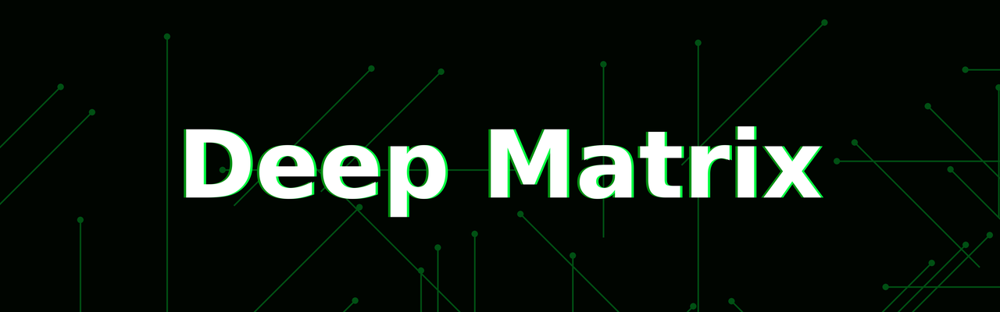
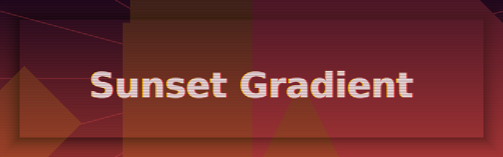
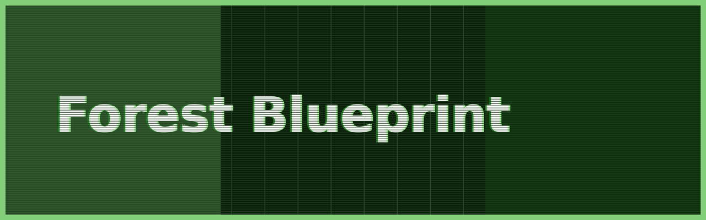
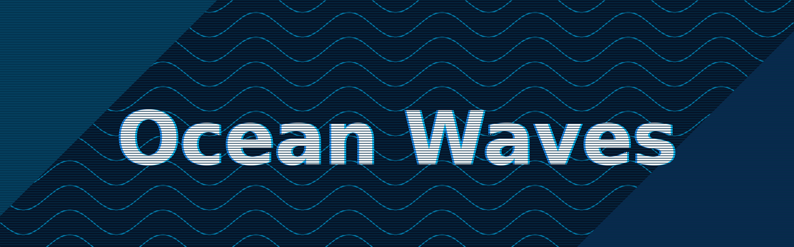
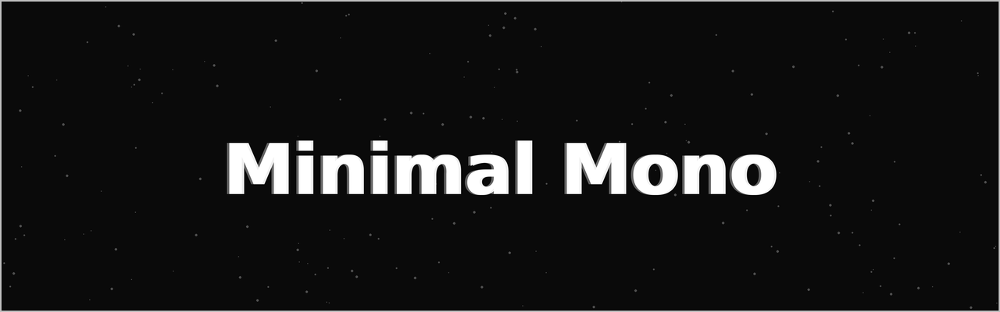

# 🎨 BrandPulse

A high-utility CLI tool to generate professional GitHub README banners with a consistent "Retro-Arcade Glitch" aesthetic.


## 🚀 Why BrandPulse?
GitHub READMEs are the front door to your projects. Manually creating banners in image editors takes too long, and generic templates lack personality. **BrandPulse** provides a terminal-first, high-fidelity branding engine that automates complex effects like super-sampling, chromatic aberration, and procedural patterns.

## 🖼️ Examples

| Cyber Glitch (Triangle Glow) | Deep Matrix (No Lines / No Glow) |
| :---: | :---: |
|  |  |

| Sunset Scatter (Gradient / Vignette) | Forest Blueprint (Rect Glow / Border) |
| :---: | :---: |
|  |  |

| Ocean Diamond (Corners / Waves) | Minimal Mono (Stars / No Lines) |
| :---: | :---: |
|  |  |

## ✨ Features
- [x] **4X Super-sampling**: Renders at 3840x1200 for razor-sharp edges.
- [x] **Theme Presets**: `Cyberpunk`, `Matrix`, `Sunset`, `Forest`, `Ocean`, and `Mono`.
- [x] **Procedural Patterns**: `Hex`, `Grid`, `Waves`, `Circuit`, `Stars`, `Dots`, and `Rays`.
- [x] **Shape Engine**: `Circle`, `Rectangle`, `Diamond`, and `Triangle` glows.
- [x] **Composition Control**: `Scatter` mode, `Mixed` shapes, and custom `Shape Counts`.
- [x] **Visual Finishing**: `Gradients`, `Vignettes`, `Borders`, and `Scanline` toggles.
- [x] **Auto-Font Engine**: Automated Google Font handling (`Orbitron`, `Space Grotesk`, `Press Start 2P`, `Inter`).

## 🛠️ Usage

### Installation
Requires Python 3 and the `Pillow` library.
```bash
pip install Pillow
```

### Advanced Examples
```bash
# Complex Composition
python3 brand.py "My Project" --theme sunset --gradient --vignette --glow scatter --glow-shape mixed --shape-count 8

# Ultra-Clean / Minimal
python3 brand.py "LocalOps" --theme mono --pattern stars --glow none --no-scanlines --border 2
```

## 🔡 Available Options
| Flag | Options | Description |
| :--- | :--- | :--- |
| `--theme` | `cyberpunk`, `matrix`, `sunset`, `forest`, `ocean`, `mono` | Color preset |
| `--glow` | `center`, `sides`, `corners`, `scatter`, `none` | Glow position |
| `--glow-shape` | `circle`, `rect`, `diamond`, `triangle`, `mixed` | Glow geometry |
| `--pattern` | `grid`, `dots`, `hex`, `rays`, `waves`, `circuit`, `stars` | BG texture |
| `--gradient` | (Switch) | Enable color blending |
| `--no-scanlines`| (Switch) | Disable retro CRT lines |
| `--vignette` | (Switch) | Darken edges |

## 📜 License
This project is licensed under the **MIT License** - see the [LICENSE](LICENSE) file for details.

---
*Created by Lex (CoM Meta-Agent) // Utility Engine*
